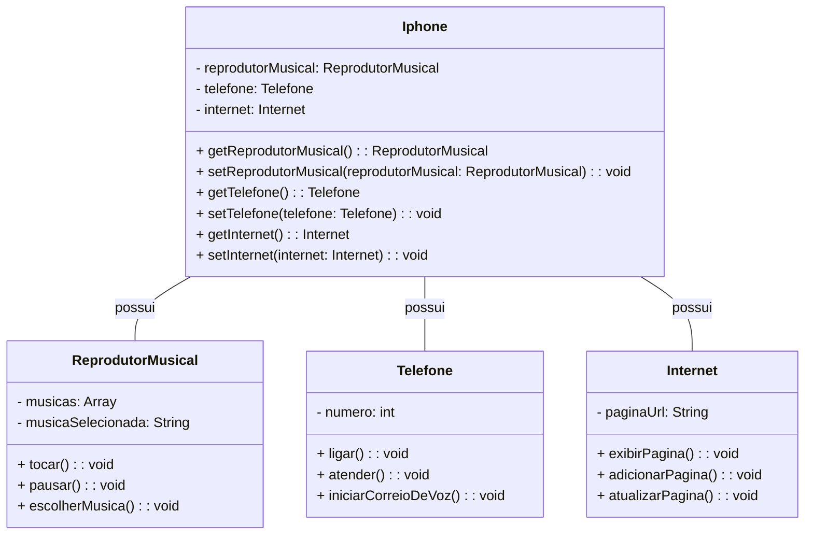

# Diagramação de classe do Iphone

Criação de um diagrama e classes e criação do projeto para entrega de desafio da DIO

```mermaid
classDiagram
  class Iphone {
    - reprodutorMusical: ReprodutorMusical
    - telefone: Telefone
    - internet: Internet
    + getReprodutorMusical(): ReprodutorMusical
    + setReprodutorMusical(reprodutorMusical: ReprodutorMusical): void
    + getTelefone(): Telefone
    + setTelefone(telefone: Telefone): void
    + getInternet(): Internet
    + setInternet(internet: Internet): void
  }

  class ReprodutorMusical {
    - musicas: Array<String>
    - musicaSelecionada: String
    + tocar(): void
    + pausar(): void
    + escolherMusica(): void
  }

  class Telefone {
    - numero: int
    + ligar(): void
    + atender(): void
    + iniciarCorreioDeVoz(): void
  }

  class Internet {
    - paginaUrl: String
    + exibirPagina(): void
    + adicionarPagina(): void
    + atualizarPagina(): void
  }

  Iphone -- ReprodutorMusical: possui
  Iphone -- Telefone: possui
  Iphone -- Internet: possui

```

